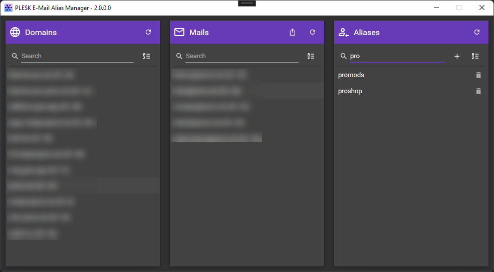

# Plesk Email Alias Manager
This tool is a product of a quick solution to create mail alias accounts for e-mail addresses hosted with PLESK using the XML API.
Also i wanted to play around with the (MaterialDesignInXAML)[https://github.com/MaterialDesignInXAML/MaterialDesignInXamlToolkit]
Feel free to use it how you like.

# Screenshot

